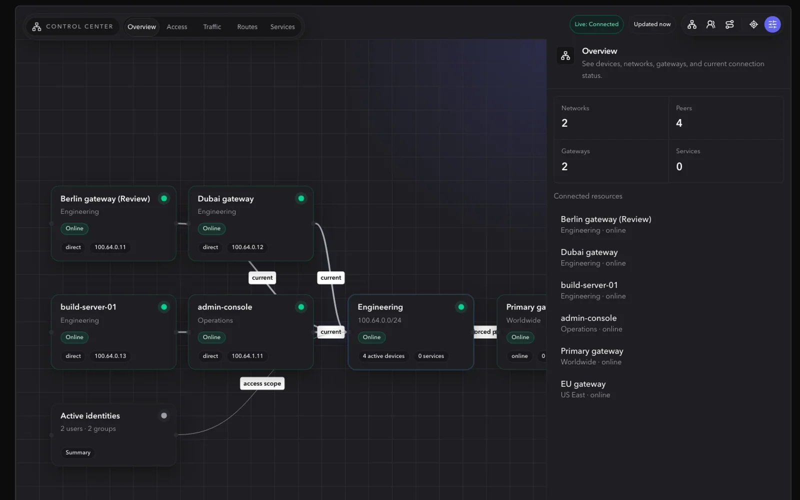
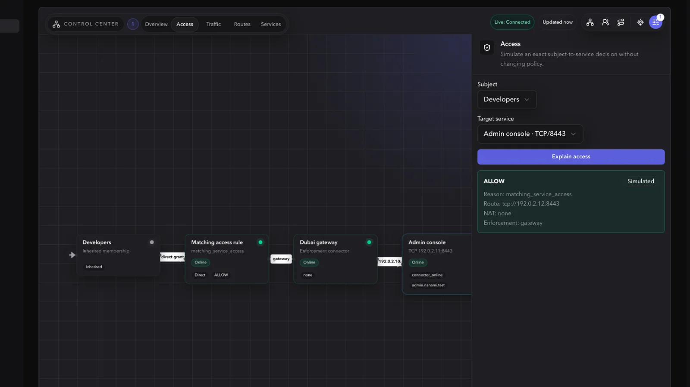
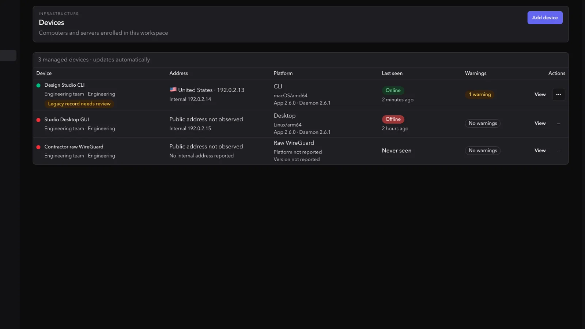
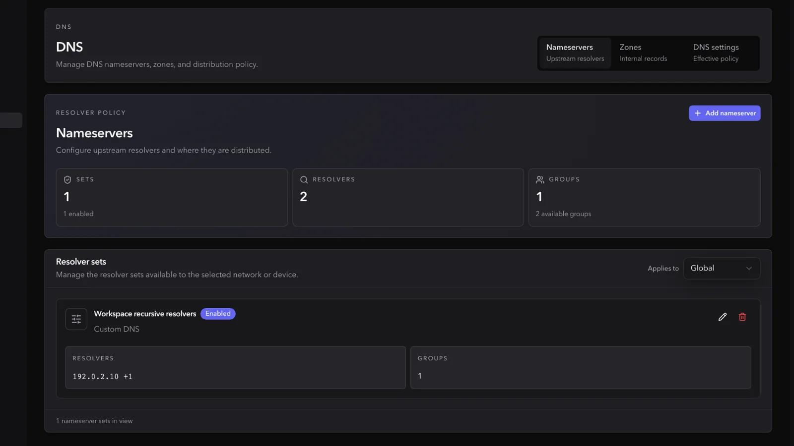
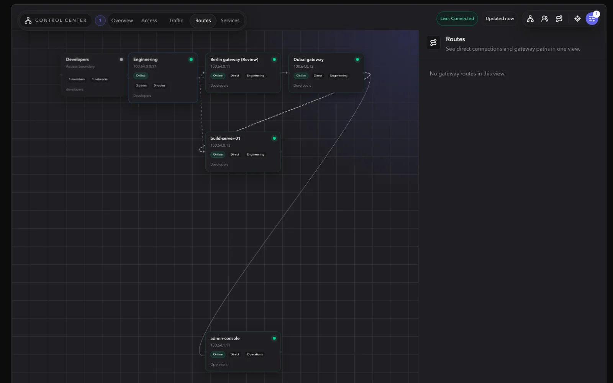
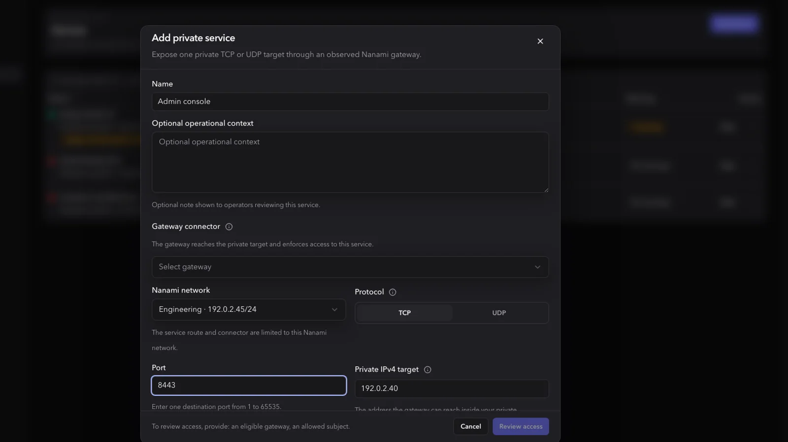
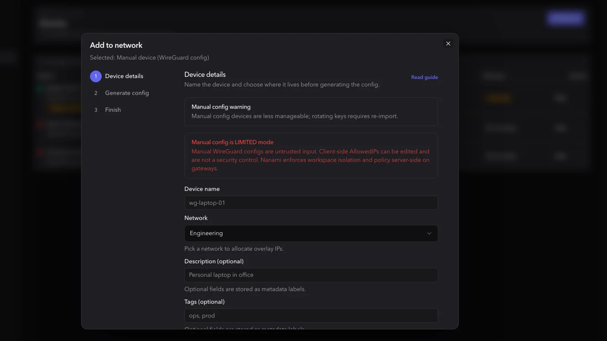
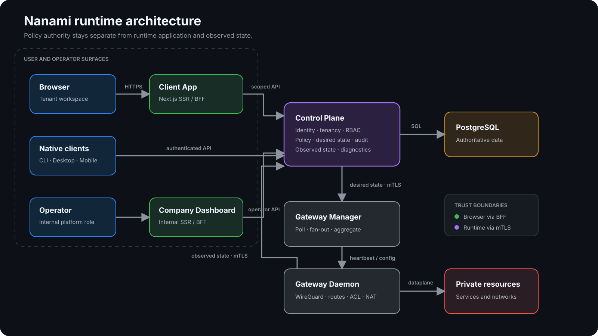

# Nanami Platform — Engineering Showcase

[](https://github.com/xryceu/nanami-platform-showcase/actions/workflows/ci.yml)
[](https://go.dev/)
[](https://nextjs.org/)
[](https://www.electronjs.org/)
[](https://www.typescriptlang.org/)
[](LICENSE)

Nanami is an independently built, multi-tenant private networking platform. It combines a policy-aware control plane, WireGuard gateway orchestration, web and native clients, and operator tooling in one product.

This repository is a curated engineering showcase. It contains real, runnable excerpts from the private codebase, architecture notes, tests, and product screenshots. The complete implementation, production configuration, deployment topology, and security-sensitive integration code remain private.

## Live environments

| Surface                   | Link                                                                           | Access                |
| ------------------------- | ------------------------------------------------------------------------------ | --------------------- |
| Product website           | [marketing-s-nanami.xryceu.dev](https://marketing-s-nanami.xryceu.dev)         | Public                |
| Documentation             | [documentation-s-nanami.xryceu.dev](https://documentation-s-nanami.xryceu.dev) | Public                |
| SaaS client app           | [dashboard-s-nanami.xryceu.dev](https://dashboard-s-nanami.xryceu.dev/login)   | Test account required |
| Community client app      | [dashboard-c-nanami.xryceu.dev](https://dashboard-c-nanami.xryceu.dev/login)   | Test account required |
| Internal operator console | [company-s-nanami.xryceu.dev](https://company-s-nanami.xryceu.dev/login)       | Restricted            |

These are non-production environments. Data may be reset and availability is not guaranteed. No credentials are stored in this repository.

## Product tour

The screenshots below come from the running Nanami test environments and use synthetic demonstration data.

### Control Center

The graph-first workspace brings networks, devices, gateways, routes, services, and access decisions into one operational view.



### Explainable access

Operators can simulate a subject-to-service decision and see the matched rule, route, gateway, enforcement point, and final result without changing policy.



### Infrastructure and DNS

| Managed devices                                                      | DNS runtime policy                                                                |
| -------------------------------------------------------------------- | --------------------------------------------------------------------------------- |
|  |  |

### Routing and private services

| Network path visualization                                             | Private service workflow                                                             |
| ---------------------------------------------------------------------- | ------------------------------------------------------------------------------------ |
|  |  |

### Safe manual WireGuard onboarding

Manual configurations are supported as an explicitly limited mode. The product explains that client-edited `AllowedIPs` are not an authorization boundary and keeps enforcement server-side.



## What I built

- A Go control plane for identity, tenancy, RBAC, inventory, desired state, observed state, audit, DNS, and routing policy.
- A gateway-manager control loop and a Linux gateway daemon that reconcile WireGuard interfaces, routes, ACLs, and NAT.
- A Next.js tenant application and a separate internal operator application with server-side BFF boundaries.
- A cross-platform Go CLI plus Electron, SwiftUI, and Kotlin/Compose native client foundations.
- Community and hosted deployment workflows, runtime diagnostics, security checks, and release gates.

The system is intentionally designed around explicit ownership and trust boundaries: the control plane owns policy, runtime agents apply scoped desired state, browsers never receive internal service authority, and private WireGuard key material stays client-local.

## Architecture



The primary runtime path is:

```text
Browser / native client
        |
        v
Client App (SSR/BFF) ---> Control Plane ---> PostgreSQL
                               |
                      desired / observed state
                               |
                               v
                       Gateway Manager
                               |
                        heartbeat/config
                               |
                               v
                        Gateway Daemon
                               |
                     WireGuard / routes / ACL / NAT
```

Read the [architecture overview](docs/architecture.md) and [security model](docs/security-model.md) for the decisions behind these boundaries. For the Go application structure itself, see the [session-management architecture walkthrough](docs/go-architecture.md).

## Selected code

The excerpt is deliberately small enough to review in one sitting and complete enough to compile and test independently.

| Package                                                | What it demonstrates                                                                                                         |
| ------------------------------------------------------ | ---------------------------------------------------------------------------------------------------------------------------- |
| [`pkg/gatewayruntime`](pkg/gatewayruntime)             | Desired-state models, endpoint/DNS safety, protocol capability checks, reconciliation, cleanup, and failure-oriented tests   |
| [`pkg/gatewayorchestration`](pkg/gatewayorchestration) | Stable desired-state IDs, idempotent manager-to-daemon fan-out, and daemon-scoped delivery contracts                         |
| [`pkg/internaltransport`](pkg/internaltransport)       | Strict internal URL validation, mTLS client construction, certificate lifetime limits, and safe live certificate reload      |
| [`pkg/secretbox`](pkg/secretbox)                       | Versioned AES-256-GCM envelopes, authenticated metadata, key validation, and tamper/wrong-key rejection                      |
| [`pkg/urlutil`](pkg/urlutil)                           | Small, focused URL construction and validation helpers used at configuration boundaries                                      |
| [`internal/session`](internal/session)                 | Complete Control Plane vertical slice: domain, use cases, segregated ports, adapters, and explicit composition root          |
| [`frontend/product`](frontend/product)                 | Production-derived Next.js/TypeScript domain modules from four independently deployed web applications                       |
| [`frontend/app`](frontend/app)                         | A small review harness that renders the selected modules without private BFF, authentication, or infrastructure dependencies |
| [`electron`](electron)                                 | Production-derived Electron main/preload/renderer boundaries, strict IPC contracts, deployment validation, and native state  |

Start with the [guided code tour](docs/code-tour.md) if you have 10–15 minutes.

### Frontend surfaces

| Route                                           | Product boundary           | Selected engineering concern                                                                                                                                                                             |
| ----------------------------------------------- | -------------------------- | -------------------------------------------------------------------------------------------------------------------------------------------------------------------------------------------------------- |
| [`/client`](frontend/app/client/page.tsx)       | Tenant Client App          | [Mode-safe redirect sanitation](frontend/product/client/client-boundary.ts), legacy route ownership, and [direct versus gateway-mediated transport truth](frontend/product/client/transport-contract.ts) |
| [`/company`](frontend/app/company/page.tsx)     | Internal Company Dashboard | [Operational incident taxonomy](frontend/product/company/status/incident-taxonomy.ts), severity filtering, deterministic response merging, ownership, and remediation                                    |
| [`/marketing`](frontend/app/marketing/page.tsx) | Public Marketing           | [Remote pricing catalog validation](frontend/product/marketing/pricing.ts), timeout/fallback behavior, CTA routing, visibility filtering, and exact period totals                                        |
| [`/docs`](frontend/app/docs/page.tsx)           | Public Documentation       | [Real bilingual documentation navigation](frontend/product/docs/docs-nav.ts), deduplication, section filtering, adjacent-document contracts, and search                                                  |

### Production-derived frontend source

The core frontend sample is not generated fixture code. The selected modules were exported from the private monorepo and retain their production control flow. Only private generated types, internal module paths, and the non-public part of the commercial catalog were removed.

The [frontend provenance table](frontend/PROVENANCE.md) maps every public file to its private source and records each adaptation. The interactive pages are a thin review harness; fictional runtime records are kept separate from the production-derived product modules.

### Electron desktop client

The [`electron`](electron) package is a separate, independently verified excerpt from the real Nanami Desktop application. It demonstrates a hardened `BrowserWindow`, a narrow typed preload bridge, validated main-process IPC registration, deployment deep-link parsing, renderer state derivation, and Windows tray behavior.

The complete desktop product is larger: it also owns local daemon lifecycle, authenticated local IPC, native notifications and autostart, React/Vite UI, packaging, signing, notarization, installer upgrades, and platform acceptance proofs. Those operational and product-sensitive parts remain private. See the [Electron architecture walkthrough](docs/electron-architecture.md) and [source provenance](electron/PROVENANCE.md).

## Engineering decisions worth discussing

- **Desired vs observed state.** Runtime status is never inferred from a successful API mutation. Agents report what was actually applied.
- **Fail-closed shared gateways.** Multi-tenant placement requires explicit route-domain isolation and packet-time source/destination policy capability.
- **mTLS east-west identity.** Internal control-plane routes use certificate-backed service identity; browser headers and request payloads cannot create service authority.
- **Idempotent desired-state delivery.** Stable snapshot IDs and daemon-scoped keys make retries safe without embedding raw runtime configuration.
- **Authenticated secret envelopes.** Server-side secrets use versioned AES-GCM envelopes with the key identifier bound as authenticated data.
- **Server-first frontend.** Route pages and public-safe view models stay server-rendered; client boundaries are limited to inventory, queue, pricing, and documentation interactions that require browser state.
- **Responsive information architecture.** The same device state is presented as a comparison table on wide screens and compact records on narrow screens without horizontal-scroll dependence.
- **App-owned product boundaries.** Client, Company, Marketing, and Docs concerns remain visibly separate instead of being flattened into one generic dashboard component library.
- **Client-local private keys.** The server distributes public material and policy, while private WireGuard keys stay inside the client secret-store boundary.
- **Testable contracts.** Runtime invariants are represented in unit, fuzz, integration, and repository-level contract tests.
- **Ports and adapters.** Control Plane use cases depend on narrow persistence contracts; HTTP, PostgreSQL, clocks, and standalone test adapters remain replaceable at the application boundary.
- **Electron privilege separation.** Renderer code receives a typed, allowlisted API through an isolated preload; navigation, native APIs, deployment validation, and privileged operations stay in the main process.

## Repository scope

Included here:

- selected production-derived Go, Next.js/TypeScript, and Electron code from the control plane, all four web applications, and the desktop client;
- the tests for those packages, including a fuzz target;
- high-level architecture and security documentation;
- screenshots captured from running test environments with fictional demonstration data;
- a minimal CI workflow.

Intentionally excluded:

- complete control-plane handlers and persistence code;
- proprietary scheduling and commercial policy implementation;
- production infrastructure, environment files, domains beyond public demo links, and operational runbooks;
- credentials, certificates, customer data, telemetry, and Git history from the private repository.

See [repository scope](docs/repository-scope.md) for the selection rationale.

## Contact and evaluation

This repository is intended for technical portfolio review. If you are evaluating my work for a role and would like a guided walkthrough or temporary demo access, contact me through [GitHub](https://github.com/xryceu).

The source is available for evaluation, not distributed as an open-source release. See [LICENSE](LICENSE).
