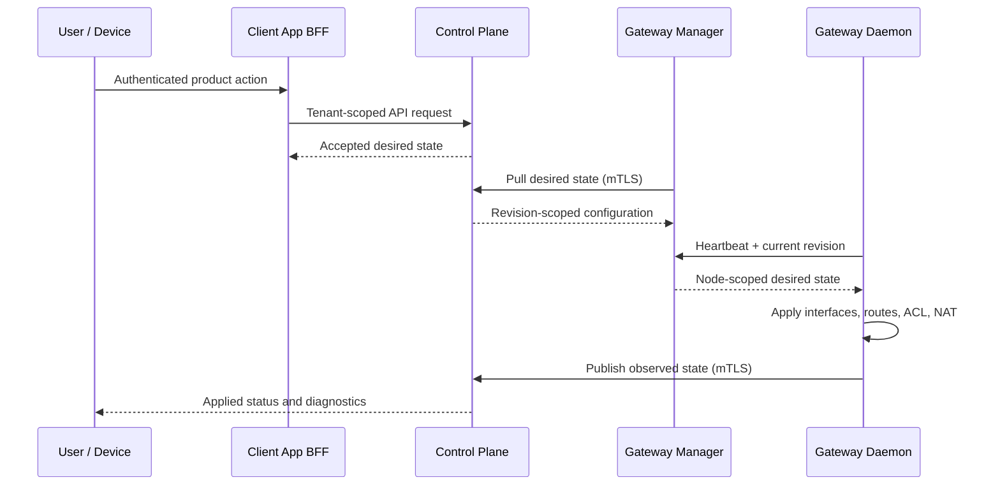

# Architecture overview

Nanami separates policy authority from runtime application. That distinction is the central architectural decision: an accepted request changes desired state, while observed state proves what the dataplane actually applied.

## Component responsibilities

| Component         | Responsibility                                                                       | Trust boundary                                                   |
| ----------------- | ------------------------------------------------------------------------------------ | ---------------------------------------------------------------- |
| Control plane     | Identity, tenancy, RBAC, inventory, policy, desired state, observed state, and audit | Authoritative policy and data boundary                           |
| Client App        | Tenant-facing Next.js SSR/BFF application                                            | Converts authenticated browser actions into scoped API calls     |
| Company Dashboard | Separate internal operator application                                               | Privileged platform operations; never a tenant navigation target |
| Gateway Manager   | Pulls desired state, coordinates gateway workers, aggregates observations            | mTLS-authenticated internal agent                                |
| Gateway Daemon    | Applies WireGuard, routes, ACLs, NAT, and runtime telemetry                          | Host/dataplane boundary                                          |
| Device clients    | CLI, desktop, iOS, and Android connection workflows                                  | Own local identity, key material, and OS networking integration  |

## Runtime flow

## Why gateway-manager exists

The manager is not a transparent proxy. It owns desired-state polling, ETag/revision handling, per-node fan-out, heartbeat coordination, observed-state aggregation, and a stable boundary for later fleet rollout strategies. Removing it would change the control-loop architecture rather than merely simplify deployment.

## Multi-tenant gateway model

Tenant ownership stays with networks, devices, assignment policy, and audit records. Gateway workers are platform dataplane inventory. A worker may serve multiple route domains only when the runtime advertises the isolation and packet-time policy capabilities required for safe sharing. Otherwise selection and readiness fail closed with explicit reasons.

## Product surfaces

The tenant-facing Client App and internal Company Dashboard are separate applications. Both use server-side BFF routes, but they have different authorization and navigation boundaries. Public documentation and marketing are separate unprivileged surfaces.

## Client model

Native clients share product state contracts but retain platform-native runtime implementations. “Authenticated,” “service running,” “driver ready,” and “tunnel connected” are distinct observations. This prevents a UI from presenting a desired or partially prepared state as a working network connection.

The Electron client adds a privilege boundary inside the desktop application. Its sandboxed renderer has no Node.js integration and receives only an allowlisted, typed API from an isolated preload. The main process validates IPC input, owns external navigation and OS integration, and communicates with the authenticated local runtime. A production-derived slice is described in the [Electron architecture walkthrough](electron-architecture.md).

## Current boundaries

The private repository contains substantially more implementation than this showcase, including persistence, full HTTP APIs, deployment automation, web applications, gateway application, and platform-specific clients. This document describes the architecture at a level suitable for public technical review without publishing deployment-specific details.
