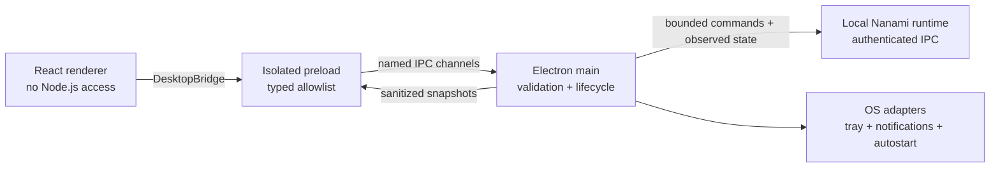

# Electron desktop architecture

The public Electron package is a reviewable slice of the private Nanami Desktop client. It preserves the production trust boundaries and representative state logic while excluding the complete product, daemon protocol, release pipeline, and platform credentials.

## Main, preload, and renderer

The main process owns native authority. [`window-policy.ts`](../electron/src/main/window-policy.ts) enables `contextIsolation`, disables Node integration, enables the renderer sandbox and web security, denies new Electron windows, and prevents renderer navigation. External links are opened only after HTTPS and credential checks.

The preload does not expose `ipcRenderer` itself. [`preload/index.ts`](../electron/src/preload/index.ts) publishes one typed `DesktopBridge` with named operations and explicit event unsubscription. Renderer code therefore cannot choose an arbitrary IPC channel or send unrestricted arguments.

[`ipc.ts`](../electron/src/main/ipc.ts) validates values again at the privileged boundary and depends on narrow runtime and settings ports. Registration returns a cleanup function so handlers do not leak across application lifecycle or test runs.

## Deployment isolation

A desktop client can connect to hosted or self-hosted deployments, so the selected server is part of the security context. [`deployment.ts`](../electron/src/main/deployment.ts) rejects credentials, query strings, fragments, and non-HTTPS remote endpoints. Loopback HTTP requires an explicit development flag.

Each normalized origin produces a stable deployment context identifier. In the private application that context scopes authentication, device enrollment, and runtime state so credentials and device identity cannot silently cross between targets.

Custom `nanami://` links are parsed as an allowlisted command shape. Unknown parameters, invalid editions, unsafe URLs, credentials, and fragments fail closed.

## Observed state and native UX

The renderer derives authentication and approval state from snapshots rather than local optimistic flags. Technical diagnostics are sanitized before they become product copy, removing credentials, local paths, socket names, and stack-frame detail.

The Windows tray adapter exposes Connect only when the session is authenticated, the native runtime is ready, and the observed client state is disconnected. Disconnect appears only for an observed connected or degraded-connected tunnel. This keeps native controls aligned with runtime truth.

## What remains private

The complete Electron application includes the React/Vite renderer, deployment capability discovery, native authentication and MFA, local daemon ownership and shutdown coordination, authenticated Unix socket or named-pipe transport, Windows service and driver inspection, release packaging, code signing, notarization, upgrade fixtures, and acceptance proofs. Publishing those systems together would disclose far more than is needed for a technical portfolio review.
