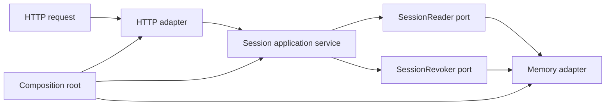

# Go application architecture

The `internal/session` package is a standalone export of the production session-management vertical slice. It demonstrates how business rules move through the Control Plane without coupling the use case to HTTP or PostgreSQL.



## Package responsibilities

```text
internal/session/
├── domain/                 entities, value types, domain errors
├── application/            use cases and narrow input ports
├── adapters/
│   ├── httpapi/            transport mapping and authenticated context boundary
│   └── memory/             standalone persistence adapter
└── wiring/                 composition root
```

The private Control Plane uses the same flow:

```text
Gin SessionHandler
        ↓
SessionService
        ↓
SessionManagementStore
        ↓
GORM SessionRepo → PostgreSQL
```

The public slice replaces Gin and GORM because publishing the full router, database model, migrations, and authentication middleware would expose far more of the private application than the architecture needs. The application rules are retained: active-session lookup, user and tenant matching, fail-closed validation, session revocation, current-session preservation, batched presence resolution, and freshness semantics.

## Design principles in the code

- **Dependency inversion:** `application.Service` depends on `SessionReader`, `SessionRevoker`, and `Clock`, not on an ORM or web framework.
- **Interface segregation:** reads and revocations are separate ports. A read-only consumer does not receive mutation capability.
- **Single responsibility:** domain types express session truth, the application layer owns use cases, adapters translate external protocols, and `wiring.Module` owns construction.
- **Open adapters:** another store can implement the ports without changing the application service. The private project uses PostgreSQL; this repository wires the memory adapter.
- **Substitutable tests:** a deterministic clock and in-memory adapter exercise the same use cases without monkey-patching global time or booting infrastructure.

## Boundary decisions

- Authentication is assumed to have happened before the handler. Verified actor and current-session identity enter through request context, never through a caller-controlled header or JSON field.
- Tenant equality is checked in the application layer even after a user-scoped repository lookup.
- Unknown, revoked, expired, cross-user, and cross-tenant sessions fail closed.
- HTTP errors remain public-safe and do not expose persistence failures.
- The memory adapter honors context cancellation and protects shared state with a mutex, so its behavior remains useful under concurrent tests.

## Production provenance

| Public file                   | Production source                                                                   |
| ----------------------------- | ----------------------------------------------------------------------------------- |
| `domain/model.go`             | `apps/control-plane/internal/core/models/session.go`, `user.go`, and presence DTOs  |
| `application/ports.go`        | `apps/control-plane/internal/service/session_service.go → SessionManagementStore`   |
| `application/service.go`      | `apps/control-plane/internal/service/session_service.go`                            |
| `adapters/httpapi/handler.go` | `apps/control-plane/internal/http/handlers/session_handler.go`                      |
| `adapters/memory/store.go`    | Public standalone substitute for `apps/control-plane/internal/repo/session_repo.go` |
| `wiring/module.go`            | Reduced composition root derived from `apps/control-plane/internal/http/server.go`  |

Names and imports were adapted to make the slice compile independently. Framework-specific plumbing and database schema were intentionally excluded; the architectural direction and session rules were not replaced with a tutorial example.
